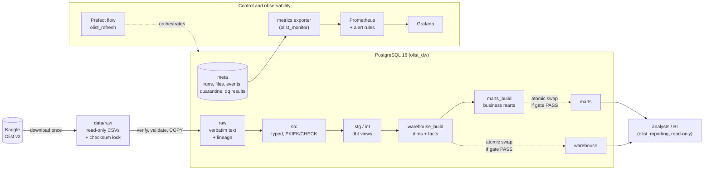

# Olist Data Platform

[](https://github.com/DanieleBrignani/olist-data-platform/actions/workflows/ci.yml)

A batch pipeline that loads the public
[Olist Brazilian e-commerce dataset](https://www.kaggle.com/datasets/olistbr/brazilian-ecommerce)
(9 CSV files, 1.55 M records, 2016–2018) into a PostgreSQL star schema and business marts,
and publishes a new version only when it passes data-quality checks.

It runs on one machine with Docker Compose. The data path is designed like a production
pipeline (data contracts, quarantine, a quality gate, atomic publication, locking), but the
operations are not: there is no high availability, no authentication on the local UIs and
no deployment pipeline. See [Known limitations](#8-known-limitations).

## 1. The problem

The nine Olist files are normalised operational extracts with real defects: a UTF-8 BOM in
one header, 261,831 duplicate geolocation rows, `review_id` values that repeat across
orders, orders without delivery dates, and incomplete months at both ends of the extract.
Answering "what share of orders arrived late, and are late orders reviewed worse?" requires
joining five of these files correctly and agreeing on what "late" means.

## 2. What the pipeline produces

| Output | Where |
|--------|-------|
| 5 dimensions and 4 facts at explicit grains (order, order line, payment, review), with primary and foreign keys enforced by PostgreSQL | schema `warehouse` ([data model](docs/data_model.md)) |
| 7 business marts: sales, payment methods, delivery, customers, sellers, categories, reviews | schema `marts` |
| Quarantined and flagged source records, with rule, severity and reason | `meta.rejected_records` |
| Run history, quality results, gate decisions, publications | `meta.*` |
| Pipeline metrics and a dashboard | Prometheus, Grafana |

Consumers read `warehouse` and `marts` through a read-only role.

## 3. Architecture



One Prefect flow runs the steps in order:

`download_or_locate_source → verify_manifest → validate_source → ingest_raw → detect_changes → [load_staging → dbt_build → dbt_test → quality_gate → publish_marts] → publish_metrics`

The bracketed steps are skipped when neither the source files nor the transformation and
quality-gate code changed since the active publication. Tools: Python 3.12, PostgreSQL 16,
dbt, Prefect 3, Alembic, Prometheus, Grafana, Docker Compose, GitHub Actions. Separate data,
control-flow and observability diagrams: [docs/architecture.md](docs/architecture.md).

## 4. Quick start

Prerequisites: Docker with Compose v2, GNU make, and Python 3 (standard library only, used
to generate `.env`). Git for Windows does not include make: on Windows use WSL, or run the
`docker compose` commands each target wraps (see the `Makefile`).

```bash
make setup      # create .env with random passwords (git-ignored) and build the images
make up         # start PostgreSQL, migrations, Prefect, exporter, Prometheus, Grafana
make pipeline   # download the dataset (~126 MB, checksum-verified) and run the flow once
make report     # business metrics from the published marts
make test       # all tests, including real-data tests (make test-ci skips those)
make down       # stop; data is kept (make reset also deletes it)
```

Prefect UI: http://localhost:4200 · Grafana: http://localhost:3000 · Prometheus:
http://localhost:9090. `make help` lists every target; day-to-day operations are in the
[runbook](docs/runbook.md).

These steps were run end to end on a fresh clone from GitHub on 2026-10-01, at commit
`8661bad` ([record](docs/production-readiness-review.md#fresh-clone-test)).

## 5. Example result

<!-- BUSINESS:START -->
Generated by `scripts/business_report.py` from the published marts (reporting role). Full report: [docs/business_metrics.md](docs/business_metrics.md).

| Business question | Answer from the published marts |
|---|---|
| How much was sold? | 99,441 orders, GMV R$ 15,735,527.03, AOV R$ 160.24, 2016-09-04 to 2018-10-17 |
| How reliable is delivery? | mean lead time 12.6 days (median 10.2) vs 24.4 promised on average; 6.8% of deliveries late |
| Are late orders reviewed worse? | late orders average 2.27 stars vs 4.29 on time; 62.4% of late orders score 1-2 vs 9.3% |
| Do customers come back? | 3.0% of 96,096 customers placed more than one order |
| How concentrated are sellers? | the top 10% of 3,095 sellers earn 67.6% of revenue |
| Which periods are unreliable? | 2016-12, 2018-09, 2018-10: incomplete edge months, flagged automatically |
<!-- BUSINESS:END -->

Definitions (full list in [docs/data_model.md](docs/data_model.md)):

* **GMV:** sum of item prices plus freight, for orders not canceled or unavailable.
* **AOV:** GMV divided by the number of such orders that have at least one item.
* **Lead time:** purchase to delivery to the customer, in days, for delivered orders.
  "Promised" is the estimated delivery date given at purchase.
* **Late:** delivered on a later calendar day than the estimated delivery date.
* **Edge month:** a month with less than 10% of its trailing three-month order volume.
* **Customer:** a person (`customer_unique_id`). Olist issues a new `customer_id` for every
  order.

Late deliveries are associated with much lower review scores. This is a descriptive
comparison: late and on-time orders can also differ in product, seller, region or season,
and the analysis does not control for that.

## 6. Engineering decisions

Each decision has an ADR in [docs/adr/](docs/adr/README.md).

* **Pinned, immutable inputs.** Every source file is checked against a committed sha256
  lock before anything is written. Files are loaded verbatim into `raw`, with the file and
  row number of every record.
* **Data contracts with quarantine.** 32 rules in `data_contracts/*.yml` type and check
  records between `raw` and `src`. Records breaking an ERROR rule go to quarantine, with
  child rows following their parent. WARNING records are kept and flagged. On Olist v2:
  0 quarantined, 542 flagged.
* **A quality gate before publication.** 51 dbt tests each carry a severity. Any CRITICAL
  failure, or an ERROR failure above its tolerance, stops the run
  ([data quality](docs/data_quality.md)).
* **Atomic publication.** dbt builds into `*_build` schemas. After the gate passes, one
  transaction renames them to `warehouse` and `marts` and keeps the previous version for
  `olist rollback-publish`.
* **Snapshot-level change detection.** Each publication stores a fingerprint of the source
  snapshots plus the transformation and gate code. An identical rerun is skipped. Any change
  rebuilds `src`, all dbt models and the gate decision in full. There is no row-level
  incremental loading or CDC: the source is a set of full snapshots
  ([incremental processing](docs/incremental.md)).
* **One writer at a time.** Every operation that writes pipeline state (the flow, the CLI
  steps, publication and rollback) holds a PostgreSQL advisory lock for its whole duration.
  A second writer waits up to 60 s, then fails with `pipeline_busy`. Readers are not blocked.
* **Retries by error type.** Connection loss and lock timeouts are retried with backoff.
  Checksum, contract, dbt and gate failures are deterministic and fail on the first attempt
  ([orchestration](docs/orchestration.md)).
* **Least-privilege roles.** Five database roles separate administration, pipeline writes,
  reporting reads, monitoring reads and Prefect metadata.

Failures found during development and review, with their causes and fixes, are logged in
[docs/what-failed.md](docs/what-failed.md).

## 7. Testing and CI

286 pytest tests run against a real PostgreSQL instance and the real dbt project.
Integration and end-to-end tests use a separate database, `olist_dw_test`.

| Category | Tests |
|----------|------:|
| Unit (including documentation checks: links, `make` targets, CLI commands) | 163 |
| Integration | 91 |
| End-to-end, synthetic data | 18 |
| Real data (the full pipeline on Olist v2, three runs) | 14 |

40 of them inject a failure: tampered files, breaking headers, rule violations, a broken
dbt model, a failed gate, a lost database connection, a killed run, concurrent writers, a
stricter gate policy. Mapping of tests to behaviours: [docs/testing.md](docs/testing.md).

Last full local run (2026-10-01, including the locking and change-detection changes): 283
passed, 269 synthetic-data tests in 20 min with 93% line coverage, then 14 real-data tests in
9 min. The three documentation checks were added afterwards; the unit suite (163) passed on
2026-10-02.

GitHub Actions (`.github/workflows/ci.yml`) runs lint, migrations up and down, the
synthetic test suite, a backup/restore check, the real-data pipeline and the image builds.
The first passing run was on 2026-10-01 (run #3, commit `18f6d5a`). The badge above shows the
current status. There is no CD: nothing is deployed ([docs/ci.md](docs/ci.md)).

### Performance

<!-- BENCHMARK:START -->
Measured by `scripts/benchmark.py` on 2026-09-29 (commit `0ae2335`), real Olist v2 data, median of 3 repetitions from an empty database. Environment and method: [docs/benchmark.md](docs/benchmark.md).

| Measure | Result |
|---------|--------|
| Source records ingested (9 files) | 1,550,922 |
| Records quarantined / flagged by contracts | 0 / 542 |
| Data-quality tests evaluated / warnings / gate | 51 / 6 / PASS |
| Initial load, end to end (empty DB → published marts) | 109.2 s (min 103.2 / max 121.0) |
| Rerun with unchanged inputs (checksum skip, change detection: no rebuild) | 2.1 s (min 1.9 / max 4.5) |
| Forced rebuild of unchanged inputs (`--full-refresh`: staging, dbt, gate, publish) | 94.6 s (min 77.7 / max 97.8) |
| Ingestion throughput | 53,738 rows/s |
| Staging throughput (raw → typed, all rules) | 37,355 rows/s |
| dbt build (33 models) + dbt test (51 tests) | 27.6 s (min 26.2 / max 31.3) + 6.5 s (min 3.9 / max 7.7) |
| Database size after load | 734.3 MB |
| Reporting query latency, median (p95) | Q1 0.3 ms (0.4); Q2 20.5 ms (23.1); Q3 0.3 ms (0.7); Q4 0.3 ms (0.4); Q5 1.0 ms (1.2); Q6 0.3 ms (0.5) |
| Published tables identical across all 3 repetitions and forced rebuilds (content md5) | yes |
<!-- BENCHMARK:END -->

Measured on a memory-constrained laptop with other containers running, so timings are only
comparable with each other. Index decisions are backed by `EXPLAIN ANALYZE` plans
([docs/query_plans.md](docs/query_plans.md)).

## 8. Known limitations

* **Single node.** One PostgreSQL instance and one Prefect worker: no replication, no
  high availability, no point-in-time recovery. Backups are manual and local
  ([backup and recovery](docs/backup-and-recovery.md)).
* **Static source.** The data ends in 2018. Late-arriving data, schema evolution and
  deletes are tested only with synthetic file versions. Freshness monitoring measures time
  since the last publication, not the age of the business events.
* **Full rebuild on any change.** A changed snapshot rebuilds all of `src` and every dbt
  model: about 95 s here, but it would not scale to much larger data.
* **Local operations only.** Prefect and Grafana have no authentication (ports are bound
  to 127.0.0.1). Alerts are evaluated but not routed. Security scans were run once and are
  not scheduled ([security](docs/security.md)). There is no retention policy for `meta`.
* **Timestamps have no time zone** in the source; they are treated as Brazilian local time.

## 9. Further documentation

* [Documentation index](docs/README.md): architecture, data model, data quality,
  orchestration, observability, testing, CI, security, backup, runbook.
* [Production-readiness review](docs/production-readiness-review.md): what was verified,
  what was not, and the risk register.
* [Repository layout](docs/README.md#repository-layout).

Dataset licence: CC BY-NC-SA 4.0 (Olist, via Kaggle). The data is downloaded at run time
and not committed.
