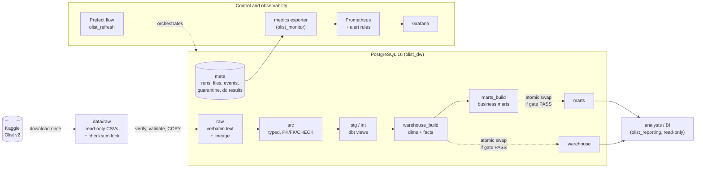

# Olist Data Platform: a quality-gated batch warehouse on real e-commerce data

[](https://github.com/DanieleBrignani/olist-data-platform/actions/workflows/ci.yml)

A single-node batch data platform that turns the public
[Olist Brazilian e-commerce dataset](https://www.kaggle.com/datasets/olistbr/brazilian-ecommerce)
(9 CSV files, 1.55 M records) into a tested PostgreSQL star schema and business marts.
Inputs are checksum-locked, bad records are quarantined, a quality gate decides whether a
new version may be published, and publication is an atomic schema swap. Built with Python,
dbt, PostgreSQL, Prefect, Prometheus, Grafana and Docker Compose.

## 1. What problem does this solve?

Olist's operational data is spread across nine related extracts, and it has real defects:
* a UTF-8 BOM in one header;
* 261,831 duplicate geolocation rows;
* `review_id` values that repeat;
* orders without delivery dates;
* incomplete edge months.

Answering "what share of orders arrived late, and does it hurt reviews?" means joining
five files by hand, knowing the OLTP status codes, working around duplicates, and
re-deriving the same metric definitions each time, with nothing to say whether the result
can be trusted.

The platform answers one question: **how do you turn fragmented operational extracts into a
warehouse that is trusted, analytics-ready, and safe to refresh?** Trust is proven on every
run:
* inputs are pinned;
* rules are explicit and have severities;
* invalid records are quarantined, never silently dropped;
* nothing is published unless it passes the gate;
* a rerun cannot duplicate or corrupt anything.

## 2. Architecture



Separate diagrams for the data flow, the control flow with its gates, and observability plus
CI are in [docs/architecture.md](docs/architecture.md). Model lineage is generated from the
dbt SQL: [docs/lineage.md](docs/lineage.md). Every design decision has an ADR:
[docs/adr/](docs/adr/README.md).

## 3. Engineering challenges

Each item was a real failure or review finding. All 38 are logged with root cause and fix in
[docs/what-failed.md](docs/what-failed.md).

* **Real data broke naive assumptions.** A BOM made a naive header check report a breaking
  change. Zip prefixes have significant leading zeros. `review_id` is not unique, so the
  review grain is `(review_id, order_id)`.
* **Idempotency across layers, not just files.** Checksums stop a file from loading twice,
  but a rerun still rebuilt everything downstream. An input fingerprint (source snapshots
  plus transformation code) now skips unchanged inputs. The first design had a subtle trap:
  after a rollback it would have kept serving old data. The fix is that every publication
  row stores the fingerprint of the version active after it.
* **Publishing only complete, validated data.** dbt builds into shadow schemas, and a
  single transaction swaps them in after the gate passes. A review found that tables left
  behind by a removed model or a killed run could be published, so build schemas are now
  emptied before every build.
* **Retrying the right things.** Retries depend on the error type. Connection loss and lock
  timeouts are retried with backoff; a checksum, contract, dbt or gate failure fails
  immediately.
* **Performance with evidence.** The staging rule engine expanded each record once per check
  (10 M rows for geolocation). A boolean prefilter took it from 15.8 s to 2.9 s with
  identical output. Every warehouse index is justified with EXPLAIN ANALYZE.
* **Least privilege that holds.** Four separate privilege problems were fixed with minimal
  grants or revokes, never a broader role. For example, a demoted `*_prev` schema stayed
  readable by reporting until the swap revoked it.

## 4. Technology stack

| Tool | Why this one |
|------|--------------|
| **PostgreSQL 16** | Real PK/FK/CHECK constraints, transactional DDL (atomic publication), roles, and `EXPLAIN ANALYZE`, in one engine that runs anywhere. The dataset is far below its limits ([ADR-0001](docs/adr/0001-postgresql-single-warehouse.md)). |
| **Python 3.12** (SQLAlchemy, psycopg 3) | Streaming CSV → `COPY` ingestion with per-record quarantine, and a set-based SQL rule engine. |
| **dbt** (dbt-postgres) | Versioned, tested, dependency-ordered SQL; enforced model contracts; lineage; failing rows stored. |
| **Prefect 3** | The flow is plain Python and runs in tests. Retry conditions are functions, so retries depend on the error type. One server and one worker fit a small host ([ADR-0003](docs/adr/0003-prefect-orchestration.md)). |
| **Prometheus + Grafana** | Metrics derived from the metadata tables at scrape time, alert rules, and a dashboard provisioned from code ([ADR-0007](docs/adr/0007-metrics-from-metadata-tables.md)). |
| **Alembic** | Reversible, reviewed schema migrations for `meta`, `raw` and `src`; CI checks that they downgrade. |
| **Docker Compose** | The whole stack (database, migrations, orchestrator, exporter, monitoring) starts with one command, with healthchecks. |
| **pytest, ruff, uv** | Tests against a real PostgreSQL and real dbt; lint and security rules; a locked, reproducible dependency set. |
| **GitHub Actions** | Lint, reversible migrations, tests, a real-data run, and image builds. |

Not used, deliberately: Spark, Kafka, a cloud warehouse, Kubernetes. The data (1.55 M
records, 734 MB in the database) does not need them, and they would add operational
surface without adding a guarantee.

## 5. Data model

A star schema built with dbt:
* **5 dimensions:** date, customer (the *person*, `customer_unique_id`, because Olist issues
  a new `customer_id` per order), product, seller and geography.
* **4 facts** at explicit grains:

| Fact | Grain |
|------|-------|
| `fct_orders` | one order |
| `fct_order_items` | one order line (`order_id`, `order_item_id`) |
| `fct_payments` | one payment instrument within an order |
| `fct_reviews` | one (`review_id`, `order_id`) |

Contracts are **enforced**: 9 primary keys and 20 foreign keys are real PostgreSQL
constraints. Seven marts cover sales, payment methods, delivery, customer behaviour, sellers,
categories and reviews.

Keys are the source's natural ids, with no SCD2, because a single snapshot has no history
([ADR-0011](docs/adr/0011-natural-keys-no-scd2.md)). Grain, keys, additive and non-additive
measures, and why each dimension exists: [docs/data_model.md](docs/data_model.md).

## 6. Data quality

One severity vocabulary (WARNING / ERROR / CRITICAL) at three checkpoints
([ADR-0004](docs/adr/0004-data-quality-layers-and-severity.md)):

1. **Files:** size and sha256 against the committed lock
   (`data_contracts/manifest.lock.json`), and the header against the contract. A breaking
   change stops the run before any write.
2. **Records (raw → src):** 32 contract rules in `data_contracts/*.yml`, evaluated as
   set-based SQL.
   * ERROR records are quarantined in `meta.rejected_records` with rule, severity, run and
     reason. FK children cascade.
   * WARNING records are kept and flagged.
   * On Olist v2: 0 quarantined, 542 flagged.
3. **Models:** 51 dbt tests, each with a severity. They include reconciliation of `src`
   against the warehouse to the cent, marts against facts, cross-file timelines, and a
   grain test on every intermediate model.

The **quality gate** fails on any CRITICAL failure, and on any ERROR failure above its
tolerance. A FAIL stops the run before publication, so consumers keep the previous version.
Unclassified tests count as CRITICAL. Thresholds were set after measuring each rule on the
real data. Details: [docs/data_quality.md](docs/data_quality.md).

## 7. Orchestration

One Prefect flow, `olist_refresh`, is one tracked pipeline run:

`download_or_locate_source → verify_manifest → validate_source → ingest_raw → detect_changes → [load_staging → dbt_build → dbt_test → quality_gate → publish_marts] → publish_metrics`

* **Change detection:** the bracketed steps run only when the input fingerprint differs
  from the active publication, or with `--full-refresh`
  ([docs/incremental.md](docs/incremental.md)).
* **Timeouts:** every task has one, and the flow has 2 hours.
* **Retries by error type:** transient errors get bounded exponential backoff with jitter;
  deterministic errors fail on the first attempt. This is proven on a real Prefect engine.
* **No result caching:** a step with side effects is never skipped by the orchestrator.
* **Serialized runs:** the deployment allows one run at a time. A run killed without its
  failure handler is closed as `abandoned` by the next run.

Per-task policy table: [docs/orchestration.md](docs/orchestration.md). Failure scenarios and
recovery: [docs/failure-recovery.md](docs/failure-recovery.md).

## 8. Observability

* **Logs:** every line is JSON, including third-party libraries, with `pipeline_run_id`,
  `task`, `rows_read/written/rejected`, `duration_ms`, `status` and `error_type`.
* **Metrics:** derived at scrape time from the append-only `meta` tables, not pushed. They
  stay monotonic across batch processes and agree with SQL:
  * `pipeline_runs_total`, `pipeline_failures_total`, `pipeline_duration_seconds`;
  * `rows_processed_total`, `rows_rejected_total`, `data_quality_failures_total`;
  * `dataset_freshness_seconds`.
* **Dashboard:** Grafana, provisioned from code. A test checks that every panel uses only
  metrics the exporter really exposes.
* **Alerts:** pipeline failed, gate failed, warehouse stale, metrics unavailable. They are
  evaluated by Prometheus and not routed anywhere (no Alertmanager).

Details: [docs/observability.md](docs/observability.md).

## 9. Testing

**265 tests**, run against a real PostgreSQL and the real dbt project. Integration and e2e
tests use a separate database, `olist_dw_test`.

| Category | Tests | What they prove |
|----------|------:|-----------------|
| Unit | 158 | contracts, schema checks, the retry policy, gate semantics, change detection, fingerprints, CLI, generated-doc guards |
| Integration | 78 | file → Postgres, raw → src rules and quarantine, roles and grants, dbt models with hand-computed values, gate and publication, the exporter, retries on a real Prefect engine |
| End-to-end, synthetic data | 15 | the whole flow, change detection (new/changed/deleted rows, logic changes, rollback), failure recovery |
| Real data (`source_data`) | 14 | the full pipeline on Olist v2 three times: every record accounted for, byte-identical tables, no duplicates |
| *of which failure injection* | 28 | tampered and malformed files, breaking headers, rule violations, a broken dbt model, a failed gate, the database down, a killed run ([docs/testing.md](docs/testing.md)) |

Latest runs (2026-09-29/10-01): **all 265 passed.** The 249 synthetic-data tests took
16.6 min with **93% line coverage** (`olist_platform` and `orchestration`); the 14 real-data
tests and a final unit-suite run (158, including the README checks) ran separately.

## 10. CI/CD

`.github/workflows/ci.yml` runs four jobs on every push and pull request:
* **lint:** ruff, promtool, actionlint.
* **test:** migrations up → down → up, contract validation, `dbt compile`, `make test-ci`
  (coverage and JUnit), and `make verify-backup`.
* **real-data:** the full pipeline on the real dataset; a CRITICAL quality failure fails CI.
* **images:** Docker builds.

**Status: passing on GitHub-hosted runners** (first green run: 2026-10-01, CI #3, 22 min 33 s
in total; the real-data job took 9 min 39 s, including the anonymous Kaggle download). The first
run failed in the lint job on an unresolvable action tag; that fix and the full history are in
[docs/ci.md](docs/ci.md). No deployment step exists, because there is no target environment to
deploy to.

## 11. Performance

<!-- BENCHMARK:START -->
Measured by `scripts/benchmark.py` on 2026-09-29 (commit `0ae2335`), real Olist v2 data, median of 3 repetitions from an empty database. Environment and method: [docs/benchmark.md](docs/benchmark.md).

| Measure | Result |
|---------|--------|
| Source records ingested (9 files) | 1,550,922 |
| Records quarantined / flagged by contracts | 0 / 542 |
| Data-quality tests evaluated / warnings / gate | 51 / 6 / PASS |
| Initial load, end to end (empty DB → published marts) | 109.2 s (min 103.2 / max 121.0) |
| Rerun with unchanged inputs (checksum skip, change detection: no rebuild) | 2.1 s (min 1.9 / max 4.5) |
| Forced rebuild of unchanged inputs (`--full-refresh`: staging, dbt, gate, publish) | 94.6 s (min 77.7 / max 97.8) |
| Ingestion throughput | 53,738 rows/s |
| Staging throughput (raw → typed, all rules) | 37,355 rows/s |
| dbt build (33 models) + dbt test (51 tests) | 27.6 s (min 26.2 / max 31.3) + 6.5 s (min 3.9 / max 7.7) |
| Database size after load | 734.3 MB |
| Reporting query latency, median (p95) | Q1 0.3 ms (0.4); Q2 20.5 ms (23.1); Q3 0.3 ms (0.7); Q4 0.3 ms (0.4); Q5 1.0 ms (1.2); Q6 0.3 ms (0.5) |
| Published tables identical across all 3 repetitions and forced rebuilds (content md5) | yes |
<!-- BENCHMARK:END -->

What the numbers show:
* **Change detection removes almost the whole cost of a rerun.** An unchanged rerun takes
  about 2 s, mostly spent re-hashing the 126 MB of source files to prove they are unchanged.
  Rebuilding the same inputs takes about 95 s, and staging is the largest step (46 s).
* **Marts pay off:** the monthly GMV/AOV question takes 0.3 ms from `mart_sales` against
  20.5 ms from the facts (Q1 vs Q2).
* **Rebuilds are deterministic:** published tables are byte-identical across repetitions,
  and after every forced rebuild.
* **Indexes are measured, not assumed:** each warehouse index turns its lookup from a
  sequential scan into an index scan (7× to 400×). Building all five costs 0.9–3.1 s per
  rebuild, so all were kept ([docs/database_design.md](docs/database_design.md),
  [docs/query_plans.md](docs/query_plans.md)).

The benchmark runs in an isolated compose project (`make benchmark`). The host is a
memory-constrained laptop, so a spread is reported rather than a single run.

## 12. Business insight

What the governed warehouse answers, generated from the published marts by
`scripts/business_report.py`:

<!-- BUSINESS:START -->
Generated by `scripts/business_report.py` from the published marts (reporting role). Full report: [docs/business_metrics.md](docs/business_metrics.md).

| Business question | Answer from the governed warehouse |
|---|---|
| How much was sold? | 99,441 orders, GMV R$ 15,735,527.03, AOV R$ 160.24, 2016-09-04 to 2018-10-17 |
| How reliable is delivery? | median lead time 10.2 days vs 24.4 promised; 6.8% of deliveries late |
| Does lateness matter? | late orders average 2.27 stars vs 4.29 on time; 62.4% of late orders score 1-2 vs 9.3% |
| Do customers come back? | 3.0% of 96,096 customers placed more than one order |
| How concentrated are sellers? | the top 10% of 3,095 sellers earn 67.6% of revenue |
| Which periods are unreliable? | 2016-12, 2018-09, 2018-10: incomplete edge months, flagged automatically |
<!-- BUSINESS:END -->

The most actionable finding needs three files joined at the right grain: **late deliveries
cost satisfaction far more than they cost time.** They are a small minority of deliveries,
yet most of them end in a 1–2 star review. That makes delivery reliability, not price, the
first lever on customer satisfaction.

## 13. Quick start

Prerequisites: Docker with Compose v2, GNU make and Python 3 (standard library only, used to
generate `.env`). On Windows, use Git Bash with make, or run the `docker compose` commands
that `make help` wraps.

```bash
make setup      # create .env with random secrets (never committed) and build the images
make up         # PostgreSQL, migrations, Prefect, exporter, Prometheus, Grafana; waits until healthy
make pipeline   # download the dataset (~126 MB, checksum-verified) and run the flow once
make report     # business metrics from the published marts
make test       # every test, including the real-data ones (make test-ci skips those)
make down       # stop; data is kept (make reset also deletes it)
```

Verified end to end on a fresh clone from GitHub (2026-10-01): about 33 min from `git clone`
to `make down`, 265 tests passed, and the published tables were identical to an existing stack
([details](docs/production-readiness-review.md#fresh-clone-test)).

* Prefect: http://localhost:4200
* Grafana: http://localhost:3000
* Prometheus: http://localhost:9090

Other commands: `make lint`, `make dbt-test`, `make unit-test`, `make integration-test`,
`make e2e-test`, `make backup`, `make restore FILE=...`, `make benchmark`. Operations:
[docs/runbook.md](docs/runbook.md).

## 14. Repository structure

```
src/olist_platform/     ingestion, staging rule engine, publication, quality gate, exporter, CLI (`olist`)
orchestration/          Prefect flow, retry/timeout policy, deployment server
dbt/                    models (staging → intermediate → core → marts), tests, macros
data_contracts/         one YAML contract per source file + the committed checksum lock
migrations/             Alembic migrations for meta, raw and src
tests/                  unit/, integration/, e2e/ + synthetic data builders
monitoring/             Prometheus config and rules; Grafana provisioning and dashboard
docker/, infra/         Dockerfiles; PostgreSQL bootstrap (roles, databases)
scripts/                benchmark, EXPLAIN analysis, business report, lineage/dashboard generators, backup/restore
docs/                   architecture, ADRs, data model, quality, operations, reviews (index: docs/README.md)
benchmark/results.json  raw output of the last benchmark
```

## 15. Known limitations

* **Single node:** one PostgreSQL instance and one Prefect worker, with no replication, HA
  or point-in-time recovery. Backups are manual (`make backup`), local, and verified by a
  round-trip test ([docs/backup-and-recovery.md](docs/backup-and-recovery.md)).
* **Static historical source:** Olist v2 ends in 2018. Late data, schema evolution and
  incremental changes are exercised with synthetic versions in tests, not observed in
  production. "Freshness" measures publication, not business recency.
* **Full rebuild when inputs change:** any changed snapshot rebuilds all of `src` and every
  dbt model. This is fine at 1.5 M rows and would not scale 100×
  ([docs/incremental.md](docs/incremental.md)).
* **Local-only operations:**
  * Prefect and Grafana have no authentication (ports bound to 127.0.0.1; Grafana allows
    anonymous viewers).
  * Alerts are not routed, and logs are not centralized.
  * Security scans are one-off, not scheduled ([docs/security.md](docs/security.md)).
* **Metadata grows without bound:** there is no retention policy for `meta.*`.
* **Source timestamps have no time zone;** they are treated as Brazilian local time.
* **Benchmark numbers** come from a noisy laptop. They are comparable with each other, not
  absolute.

## 16. Future improvements

In order of value for a real deployment:

1. **Managed PostgreSQL** with backups, PITR and a read replica for reporting. Scheduled,
   off-host backups with a periodic restore test (the round-trip script already exists).
2. **Per-table incremental staging:** rebuild only the `src` tables whose snapshot changed.
   The fingerprint already knows which.
3. **Security for shared use:** authentication in front of Prefect and Grafana, a secrets
   manager, alert routing to on-call, and scheduled dependency and image scans in CI.
4. **CD:** push images to a registry and promote them through a staging environment. The
   `OLIST_IMAGE_PREFIX` setting and the `images` job are the hooks.
5. **Retention** for metadata and quarantine samples, and row-count anomaly checks per
   table.
6. **For a change-feed source:** surrogate keys and SCD2 dimensions, plus incremental facts
   with per-partition publication.

Further reading: [production-readiness review](docs/production-readiness-review.md) ·
[interview guide](docs/interview-guide.md) · [documentation index](docs/README.md).
Dataset licence: CC BY-NC-SA 4.0 (Olist, via Kaggle). The data itself is not committed.
