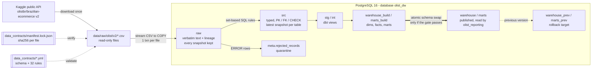
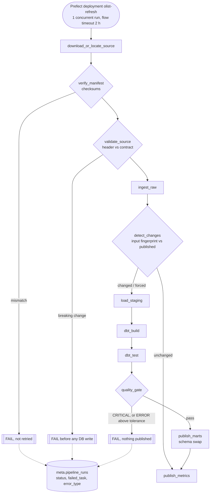
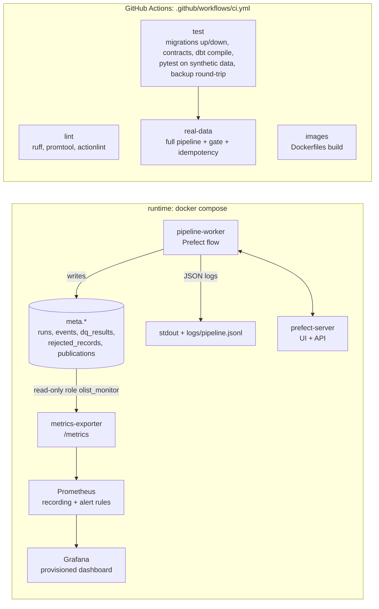

# Architecture

> Nothing in this document is a claim about measured performance; measurements live in
> `docs/benchmark.md`, generated by `scripts/benchmark.py`.

## 1. Context

The Olist public dataset is a snapshot of an operational e-commerce system: 9 CSV files
(orders, items, payments, reviews, customers, sellers, products, geolocation, category
translation). The files are normalised for OLTP use, contain known quality issues
(duplicate geolocation rows, reviews with duplicate `review_id`, orders without delivery
timestamps, product categories without translation) and no business-level documentation
beyond the Kaggle description.

The platform turns that snapshot into a governed, tested, dimensional warehouse that can be
**rebuilt safely at any time**, and proves it with tests, metrics and measured benchmarks.

## 2. Architecture

A single-node batch platform: one PostgreSQL instance, Python/dbt jobs in containers,
Prefect for control, Prometheus/Grafana for monitoring. The three diagrams split the
**data flow**, the **control flow** and **observability**, because they fail differently.

### 2.1 Data flow

### 2.2 Control flow (orchestration and gates)

Retries apply only to failures classified as transient (network, connection loss, lock
timeout; `orchestration/policies.py`). A checksum, contract, dbt or gate failure is
deterministic and fails on the first attempt.

### 2.3 Observability and CI

Metrics are derived from the `meta` tables, not pushed by the pipeline, so a crashed run
cannot leave a stale gauge behind (no Pushgateway).

This is a deliberately **single-node** design: no distributed compute and no streaming. The
dataset is about 1.5 M rows and 734 MB in PostgreSQL. The data does not justify Spark, Kafka
or a cloud warehouse, and adding them would not make the platform more correct.

## 3. PostgreSQL schemas (one database: `olist_dw`)

| Schema            | Owner / writer        | Built by   | Contents                                                             |
|-------------------|-----------------------|------------|----------------------------------------------------------------------|
| `meta`            | admin / pipeline      | Alembic    | run metadata, file registry, events, quarantine, DQ results, publications |
| `raw`             | admin / pipeline      | Alembic    | 1:1 TEXT copy of each file + lineage columns (`_source_file_id`, `_row_number`, `_pipeline_run_id`) |
| `src`             | admin / pipeline      | Alembic    | typed, contract-conforming source tables with PK / FK / NOT NULL / CHECK |
| `stg`, `int`      | pipeline              | dbt        | views: renaming, standardisation, business logic building blocks      |
| `warehouse_build` | pipeline              | dbt        | dimensions & facts (tables, enforced dbt contracts, indexes)          |
| `marts_build`     | pipeline              | dbt        | business marts                                                       |
| `warehouse`,`marts` | pipeline (after swap) | publish step | **published** layer; the only schemas `olist_reporting` can read |
| `dq_failures`     | pipeline              | dbt (`store_failures`) | failing rows of dbt tests, for investigation          |

Why both `raw` and `src`? `raw` is a lossless, set-queryable copy of the file, so every
rejected record can be traced back to `(file sha256, row number, original text)`.
`src` is what the contract promises to downstream consumers. Casting and rule
evaluation happen *between* them, in SQL, in one transaction per file.

## 4. Runtime topology (docker compose)

| Service            | Image                                   | Purpose |
|--------------------|-----------------------------------------|---------|
| `postgres`         | postgres:16.10-bookworm                 | warehouse (`olist_dw`), test DB (`olist_dw_test`), Prefect metadata DB (`prefect`) |
| `migrate`          | runtime image (`docker/app.Dockerfile`) | one-shot `alembic upgrade head` |
| `dev` (profile)    | dev image (same Dockerfile)             | CLI, dbt, tests; used by every `make` target |
| `prefect-server`   | prefecthq/prefect:3.8.6-python3.12      | orchestration API + UI |
| `pipeline-worker`  | runtime image                           | serves the `olist-refresh` deployment and executes its runs |
| `metrics-exporter` | runtime image                           | `/metrics` derived from `meta.*` |
| `prometheus`       | prom/prometheus:v3.15.0                 | scrapes the exporter; recording and alert rules; 30-day retention |
| `grafana`          | built from `docker/grafana.Dockerfile`  | provisioned datasource and dashboard |

No BI tool is part of the default stack (see ADR-0010).

## 5. Pipeline (Prefect flow `olist_refresh`)

| Task | Timeout | Failure class | Retries |
|------|---------|---------------|---------|
| download_or_locate_source | 15 min | transient (network) | 3, exponential backoff + jitter |
| verify_manifest | 10 min | deterministic (checksum mismatch) | **none** |
| validate_source | 10 min | deterministic (breaking schema change) | none |
| ingest_raw | 30 min | transient (DB connection) vs deterministic (data) | 2, only on transient errors |
| detect_changes | 2 min | transient (DB) | 2, only on transient errors |
| load_staging | 30 min | transient vs deterministic | 2, only on transient errors |
| dbt_build / dbt_test | 30 min | deterministic (model / test failure) vs transient (DB) | 1, only on transient errors |
| quality_gate | 5 min | deterministic | none; CRITICAL → run fails, nothing published |
| publish_marts | 5 min | transient (lock timeout) | 2 |
| publish_metrics | 2 min | transient | 2 |

Retry decisions are made by exception type (`olist_platform.errors`,
`orchestration/policies.py`), not by catch-all retry counts. See ADR-0003.

## 6. Idempotency model

* Every file is identified by its **sha256**. `meta.source_files` has a unique key
  `(source_table, sha256)`.
* Re-running with an already-loaded file is a recorded no-op (`ingestion_events.event = 'skipped_already_loaded'`).
* A forced reload deletes the rows of that file (`_source_file_id`) and reloads them inside one transaction.
* `src` tables are rebuilt from `raw` for the current dataset version in one transaction.
* dbt layers are full-refresh (ADR-0006) into build schemas; published schemas change
  only by atomic swap (ADR-0005). A second run therefore produces byte-identical marts;
  the real-data idempotency test asserts this with per-table row counts + ordered hashes.

## 7. Security model (ADR-0009)

| Role              | Can                                                             |
|-------------------|-----------------------------------------------------------------|
| `postgres`        | only used by the container init script to create roles/databases |
| `olist_admin`     | owns schemas, runs Alembic migrations                           |
| `olist_pipeline`  | DML on `meta`/`raw`/`src`, CREATE in dbt schemas, performs the swap |
| `olist_reporting` | `SELECT` on `warehouse` and `marts` only                        |
| `olist_monitor`   | `SELECT` on `meta` only (metrics exporter)                      |

Credentials are only read from environment variables; `.env` is git-ignored and
`.env.example` documents every variable.
