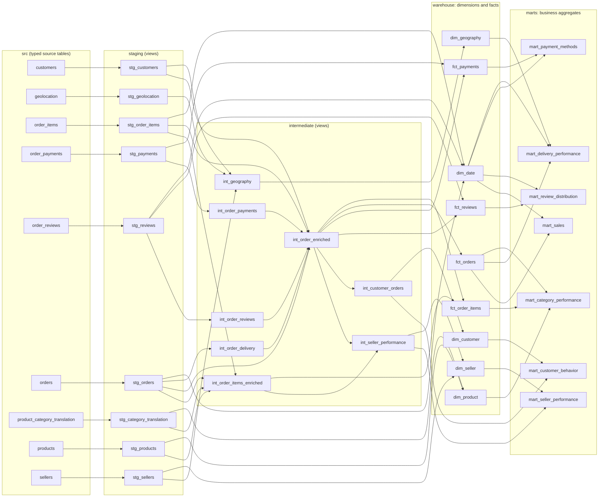

# Lineage

Generated by `scripts/build_lineage.py` from the `ref()` / `source()` calls in `dbt/models`
(do not edit by hand; `tests/unit/test_lineage_doc.py` fails if it is stale). The same graph
is available interactively with `dbt docs generate && dbt docs serve`.

`src.*` are the typed tables loaded by `olist stage`; everything to the right is dbt.
Only the last two layers are published (`warehouse`, `marts`). Grain, keys and measures of
each fact: [data_model.md](data_model.md). Column descriptions and tests live next to the
models (`_staging.yml`, `_intermediate.yml`, `_core.yml`, `_business.yml`).

